# WhereIsMyHome6 🏠

## 팀 구성현황

| 성명   | 소개 |
| ------ | ---- |
| 안승수 |      |
| 전병현 |      |

---

## 단계별 구현내역

| 난이도 | 구현 기능               | 요구사항 상세                                        | 구현 여부 |
| ------ | ----------------------- | ---------------------------------------------------- | --------- |
| 기본   | 주택 실거래가 정보 수집 | dummy data 가공                                      | O         |
| 기본   | 주택 실거래가 검색      | 주택 실거래가 검색 정보에 따라 검색 결과 데이터 제공 | O         |
| 추가   | 관심 지역 정보 관리     | 관심지역을 설정정보를 별도의 검색 기능 제공          | O         |
| 추가   | 주변 상권 정보 수집     | 공공데이터 포털 : 카페,극장 정보 활용 DB 저장        | O         |
| 추가   | 주변 시설 정보 검색     | 관심 지역 내 병원 및 은행 정보 검색 기능 제공        | O         |
| 심화   | 공지사항 관리           | 공지사항 등록, 수정, 삭제, 검색                      | O         |
| 기본   | 회원 관리               | 회원정보 가입, 수정, 검색                            | O         |
| 기본   | 로그인 관리             | 로그인 관리                                          | O         |

---

## 구현 내역 별 화면 예시

### [0] 추가 및 수정 사항

- 심화기능에서는 DB를 구축하지 않고 KAKAO MAP API 활용

  -> 폐업되거나 추가,변경사항이 발생하는 데이터에 대해서는 DB를 주기적으로 업데이트 하지 않는 이상 신뢰성이 떨어지게 되므로, 비교적 실시간 데이터를 활용할 수 있는 API를 활용함.

- 관심지역에서 추출된 데이터를 해당 지역의 중심좌표로부터 거리를 계산하여 가까운 15개 항목 추출(데이터 가공)

  -> 위도 경도 정보를 활용하여 거리를 계산하는 Haversine 공식을 통해 컬럼을 추가

- 아파트명이 동일한 거래정보 데이터가 모두 마커로 표시되는 현상 수정(데이터 중복 제거)

  -> 추출된 데이터의 위도,경도 정보를 Set 자료구조를 통해 중복을 제거한 뒤 마커로 표현함

- 서울시 일부구의 동명이 누락된 데이터를 추가함(데이터 추가)

  -> 서울시 양천구 신정동(1147010100), 서울시 강남구 신사동(1168010700)

### [1] ER-Diagram

  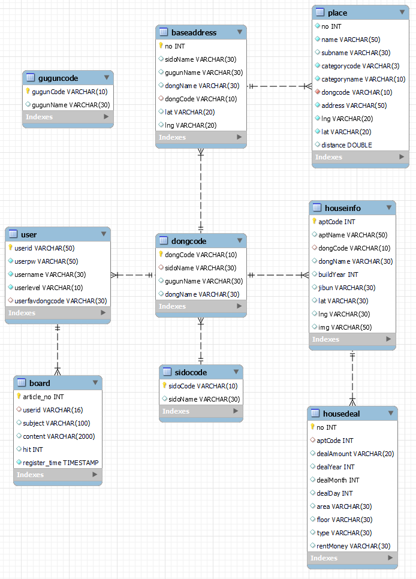

### [2] 회원 정보 데이터 관리

- 회원 가입
  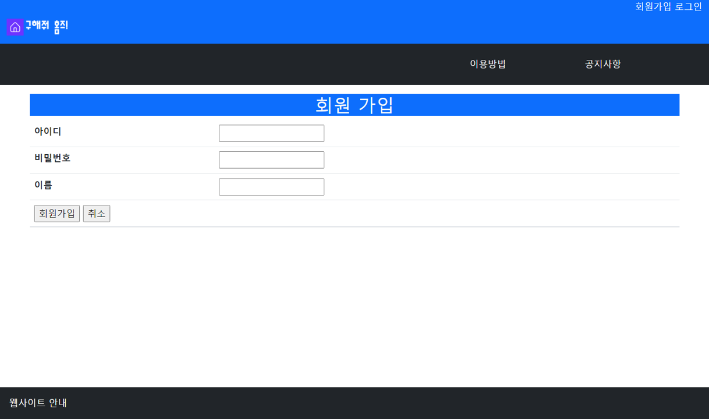

- 정보 조회, 수정, 삭제
  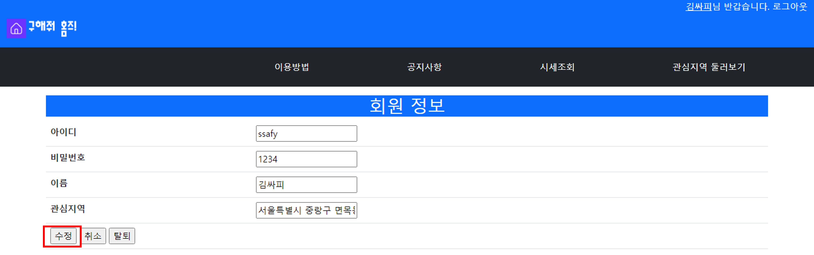
  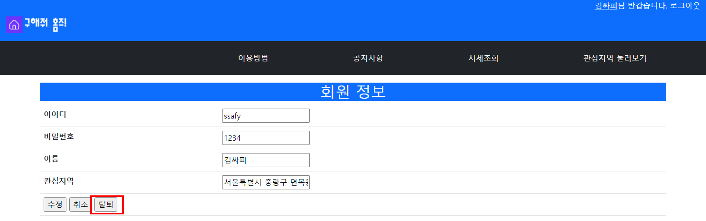

### [3] 아파트 매매 실거래가 데이터 관리

- 법정동을 통한 검색 및 결과 화면
  
  
  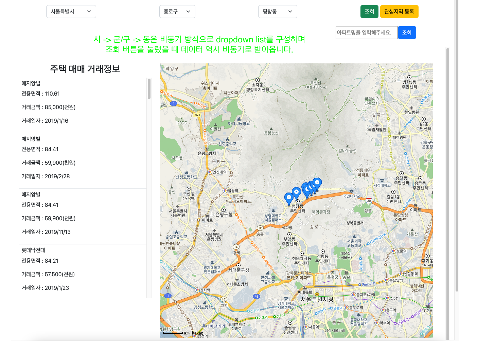
- 아파트명이 포함된 LIKE 검색 및 결과 화면
  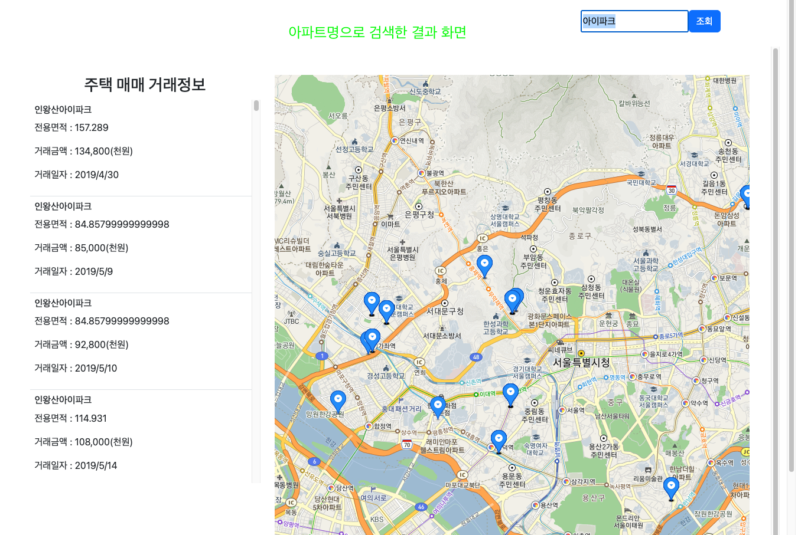

### [4] 관심지역 데이터 관리

- 관심지역 등록 전(마이페이지를 통해 등록되지 않음을 알려주고 링크를 통해 설정화면으로 이동합니다.)
  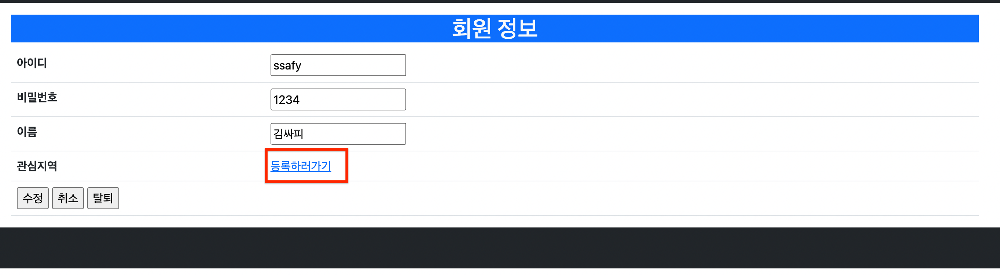
- 관심지역 등록 하기 (시세조회페이지에서 관심 행정동을 선택한 뒤 등록버튼을 통해 설정할 수 있습니다.)
  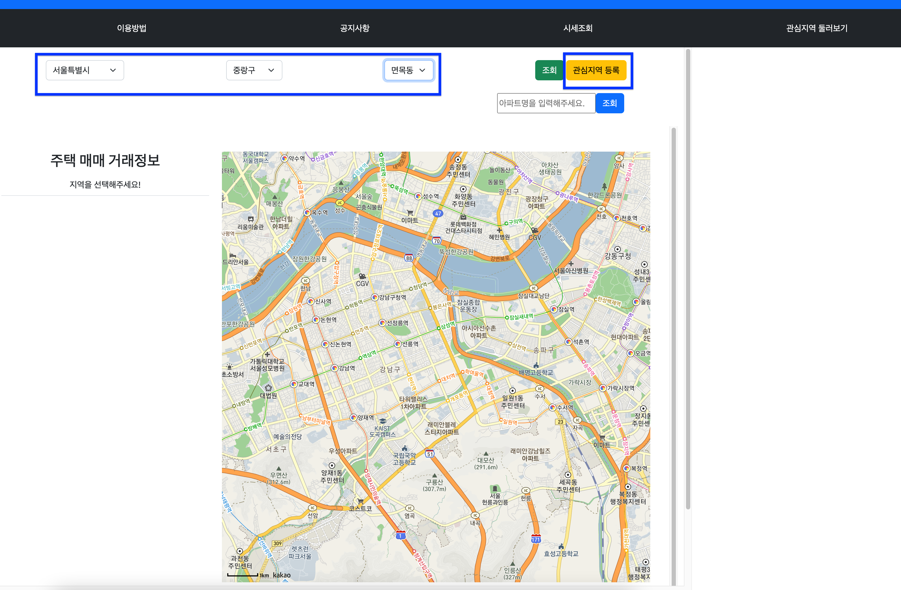
- 등록 성공 시 화면 (alert를 이용하여 관심 지역 등록에 성공한 것을 알려줍니다.)
  
- 등록 성공 시 DB (사용자 DB의 userfavdongcode라는 column에 등록한 관심지역 동 코드를 업데이트 합니다.)
  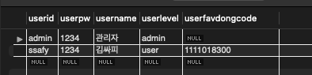
- 관심지역 등록 후(테이블에는 동코드가 저장되지만, 마이페이지에 접속하면 비동기요청을 통해 full address를 받아옵니다.)
  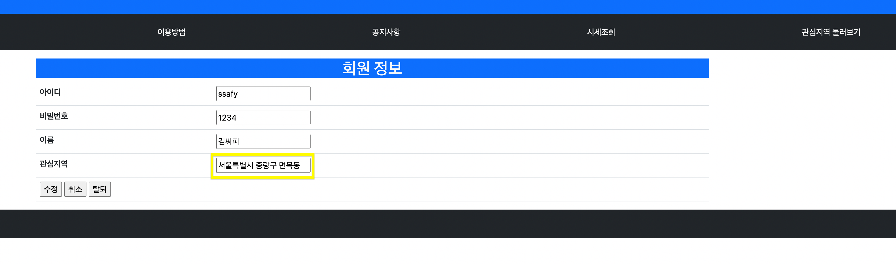
- 관심지역 둘러보기 초기화면(관심지역으로 등록한 행정동의 중심좌표를 기준으로 지도가 로딩됩니다.)
  

### [5] 동네 카페 상권 데이터 관리

- 관심 지역 카페 상권 결과 화면 (관심 지역의 중심 좌표와 가까운 상위 15개의 장소만 표시됩니다.)
  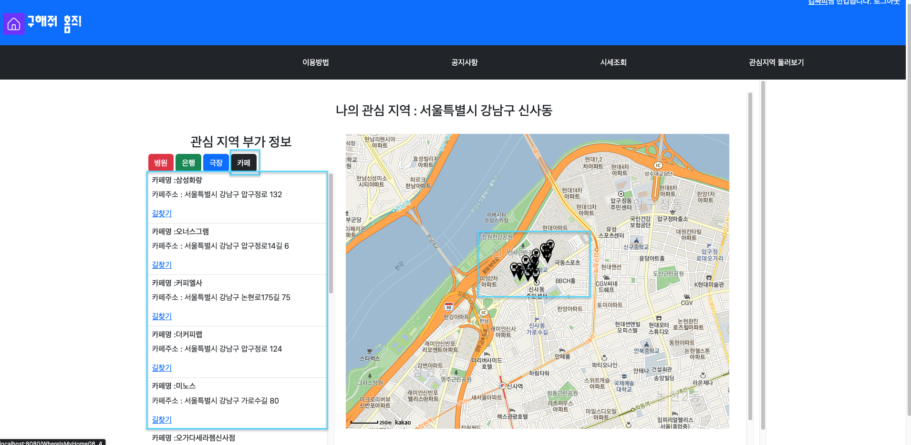

### [6] 동네 극장 정보 데이터 관리

- 관심 지역 극장 정보 결과 화면 (관심 지역의 중심 좌표와 가까운 상위 15개의 장소만 표시됩니다.)
  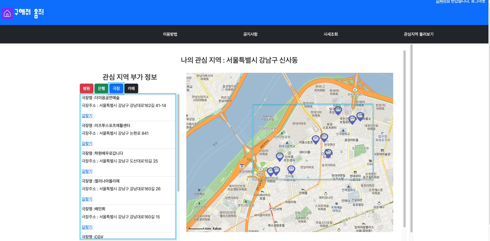

### [7] 동네 병원 정보 데이터 관리

  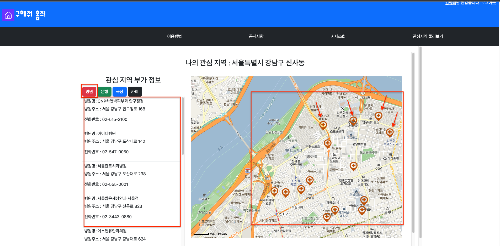

### [8] 동네 은행 정보 데이터 관리

  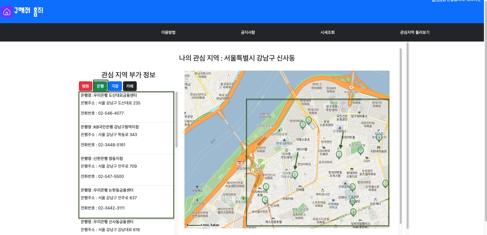
